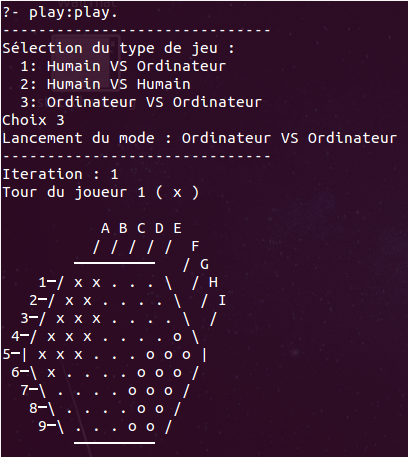
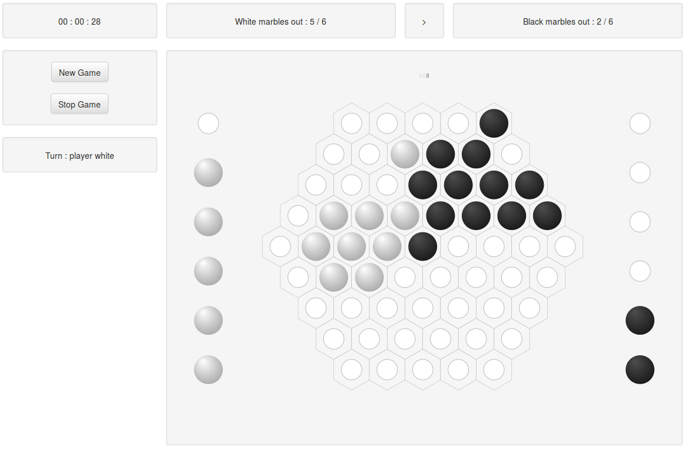
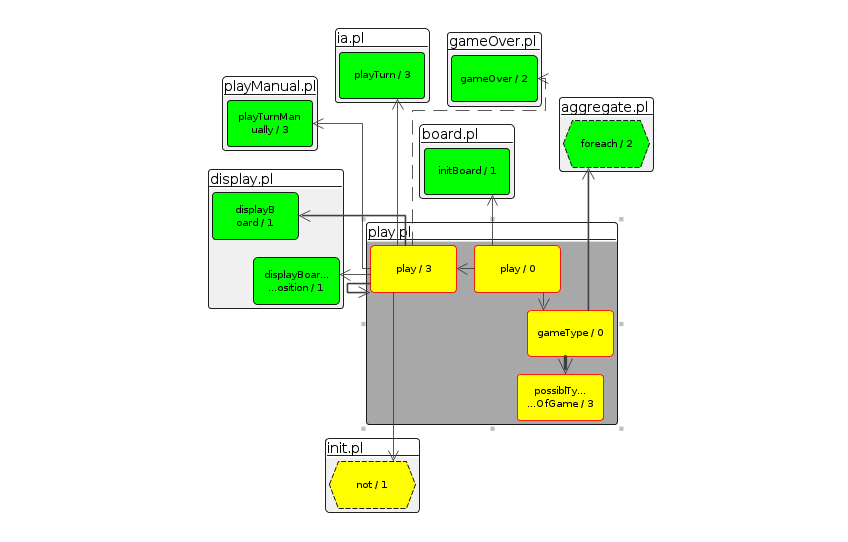
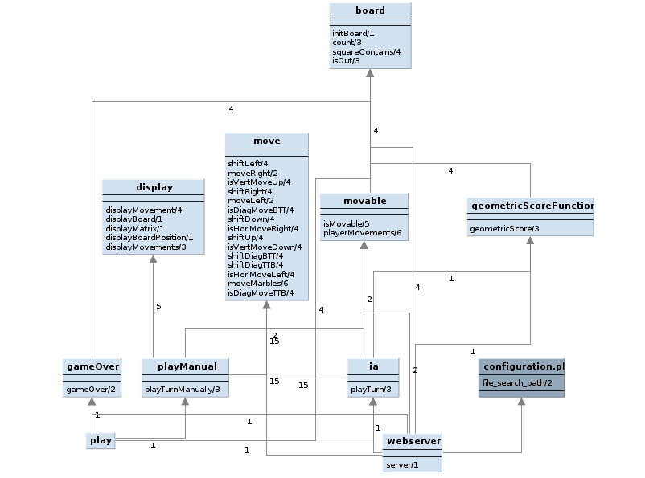

# Abalone (prolog)

Le jeu a été fait principalement en prolog avec deux interfaces disponibles :

- Une IHM console, directement accessible en ligne de commande dans prolog.
- Une IHM web, visible dans un navigateur web après le lancement du serveur prolog.

Cette réalisation a été faite dans le cadre d'un projet en école d'ingénieurs (Master 1) autour des intelligences artificielles.

## Dépendances

Il ne faut pas de dépendances particulières, cependant le web serveur demande une version de [SWI-Prolog](http://www.swi-prolog.org/) > 7.1.0.
Le jeu a été testé sur [SWI-Prolog](http://www.swi-prolog.org/) 7.2.3.

## IHM Console

Ouvrir dans prolog `play.pl`, puis lancer une partie avec le prédicat `play:play.`

### Jouer

Il y a trois modes de jeu :

- Humain contre Humain
- Humain contre Ordinateur
- Ordinateur contre Ordinateur

Suivre les instructions dans la console pour jouer.

### Configuration

Par défaut, un nombre maximum d'itérations est en place (100) afin de se prémunir des boucles infinies.
Vous pouvez modifier ce paramètre dans le haut du fichier `play.pl` (sous le prédicat play).

## IHM Web

Dans le fichier `web/index.html`, se trouve le code du plateau, qui a comme feuille de style `web/css/main.css`.
Les autres fichiers concernant l'interface web sont dans le dossier `web`.

L'interface propose elle aussi les trois modes de jeu.
Cependant, elle présente un avantage sur la configuration de l'ordinateur qui combat (agréssivité et difficulté).

### Lancement du serveur Web

- Ouvrir `configuration.pl` et mettre le chemin absolu du projet à la place de celui présent : `user:file_search_path(projectRoot, '/path/to/root/project').`
- Ouvrir dans prolog le fichier `webserver.pl` puis entrer le prédicat `server(Port)`, où `Port` est le numéro du port sur lequel le serveur peut écouter (exemple `8080`).
- Ouvrir un navigateur à l'adresse `http://localhost:8080/game` (changer `8080` par le port précédemment choisi)
- Suivez les indications de l'interface pour jouer.

## Outils

Vous trouverez plus d'explications sur les outils (génération du SVG et génération de statistiques) : [Outils](tools/README.md)

## Tests

L'ensemble des tests unitaires sont dans le dossier `tests`.
Vous pouvez lancer tous les tests en chargeant le fichier `tests.pl` qui ira automatiquement chercher tous les tests du dossier `tests`, puis exécuter le prédicat `runAllTests.`.

## Présentation

Vous trouverez le support de présentation, explicant nos choix techniques et l'heuristique de l'intelligence artificielle, dans le dossier `docs` : [Présentation](docs/presentation.pdf).

## Architecture

### Fonctionnement IHM Console

### Architecture générale

Présentation des interfaces publiques des modules :

